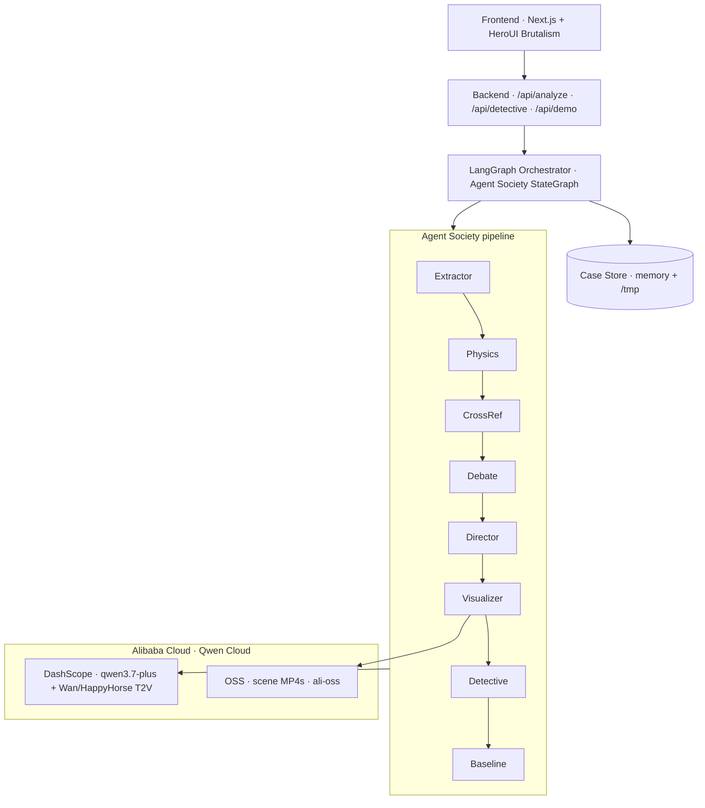

# Detectr

**AI Forensic Agent Society** — turn witness testimony into physics-checked claims, cross-referenced findings, Wan scene reconstructions, and an investigator-ready report.

Built for the **[Global AI Hackathon with Qwen Cloud](https://qwencloud-hackathon.devpost.com/)**

| Field | Value |
|-------|--------|
| **Track** | **Track 3: Agent Society** |
| **Live demo** | https://getdetectr.vercel.app |
| **Repository** | https://github.com/fozagtx/detectr |
| **License** | [MIT](LICENSE) (visible in GitHub About) |


---

## Hackathon submission (judges)

Paste these into Devpost. Full copy block also lives in [`docs/SUBMISSION.md`](docs/SUBMISSION.md).

### 1. Code repository (public + open source)

**https://github.com/fozagtx/detectr**

- Public repo with all source, assets, and setup instructions (this README)
- Open-source license: **[`LICENSE`](LICENSE)** (MIT) — shown in the GitHub **About** panel

### 2. Proof of Alibaba Cloud

Link this file on Devpost (DashScope / Qwen Cloud + OSS):

**https://github.com/fozagtx/detectr/blob/main/src/lib/alibaba.ts**

Also:

| Proof | URL |
|-------|-----|
| LangChain → DashScope chat | [`src/lib/langchain.ts`](https://github.com/fozagtx/detectr/blob/main/src/lib/langchain.ts) |
| Wan video API | [`src/agents/visualizer.ts`](https://github.com/fozagtx/detectr/blob/main/src/agents/visualizer.ts) |
| Live proof JSON | https://getdetectr.vercel.app/api/demo?proof=alibaba |

### 3. Architecture diagram



Raw SVG for Devpost upload:  
**https://github.com/fozagtx/detectr/blob/main/docs/architecture.svg**

### 4. Demo video (~3 minutes)

Upload a **public** video to YouTube / Vimeo / Facebook Video.

- Recording script: [`docs/DEMO_VIDEO.md`](docs/DEMO_VIDEO.md)
- After upload, paste the URL into [`docs/SUBMISSION.md`](docs/SUBMISSION.md) and Devpost

> Status: record + upload still required before final Devpost submit.

### 5. Project description

Detectr is a multi-agent forensic app for the Global AI Hackathon with Qwen Cloud (**Track 3: Agent Society**). Investigators enter a case and witness statements (or click **Review sample** for the Oak Street Incident). A **LangGraph** orchestrator runs a live Agent Society on **Alibaba Cloud DashScope / Qwen Cloud**:

1. **ClaimExtractor** — atomic claims with sensory tags  
2. **PhysicsValidator** — `POSSIBLE` / `UNCERTAIN` / `UNLIKELY` vs vision & acoustics limits  
3. **CrossReference** — agreements, contradictions, unique details  
4. **Debate** — Physics ↔ Detective when science conflicts with consensus  
5. **SceneDirector + Visualizer** — storyboards + live Wan/HappyHorse clips (optional **Alibaba OSS**)  
6. **Detective** — case report + grounded Q&A  
7. **Baseline** — multi-agent society vs a single Qwen pass (Track 3 comparison)

**Try it:** https://getdetectr.vercel.app → **Review sample**. Live Qwen only — no mock agents. Leave scene videos off for a fast judge path; turn them on for Wan reconstructions.

### 6. Track

**Track 3: Agent Society**

---

## Why Detectr

Investigators, witnesses, and juries often hear conflicting stories about the same night. Detectr runs a **multi-agent society** on Qwen Cloud that:

1. Extracts atomic claims from each statement  
2. Scores them against vision / acoustics limits (**physics validation**)  
3. Cross-references agreements and contradictions  
4. Debates Physics vs Detective when science conflicts with consensus  
5. Storyboards and generates **live** scene videos (Wan / HappyHorse)  
6. Synthesizes a case report and answers grounded detective questions  

**Live only.** There is no mock mode or simulated agent path. Analysis calls Qwen via LangChain; clips call DashScope video APIs.

---

## Demo flow

```
INPUT → ANALYSIS → VIDEOS → REPORT → DETECTIVE
```

| Step | What you see |
|------|----------------|
| **Case** | Case file + witnesses, or **Review sample** (Oak Street Incident) |
| **Checks** | Claims, physics scores, debate, cross-ref |
| **Scenes** | Live Wan/HappyHorse reconstructions (when enabled) |
| **Summary** | Narrative findings + optional multi vs single baseline |
| **Ask** | Detective chat grounded in the completed case file |

---

## Agent Society (LangGraph)

Orchestrator graph (`src/agents/orchestrator.ts`):

```text
extractClaims
  → validatePhysics
  → crossReference
  → negotiateDebate
  → directScenes
  → visualizeScenes
  → writeReport
  → compareBaseline
```

| Agent | Responsibility |
|-------|----------------|
| **ClaimExtractor** | Atomic claims + tags (`audio`, `motion`, `clothing`, `facial`, …) |
| **PhysicsValidator** | `POSSIBLE` / `UNCERTAIN` / `UNLIKELY` + confidence + reason |
| **CrossReference** | Agreements, contradictions, unique details |
| **Debate** | Physics ↔ Detective negotiation |
| **SceneDirector** | Storyboard prompts for key beats |
| **Visualizer** | Wan / HappyHorse T2V → optional Alibaba OSS |
| **Detective** | Final report + interactive Q&A |
| **Baseline** | Single monolithic Qwen pass for Track 3 comparison |

LLM client: [`src/lib/langchain.ts`](src/lib/langchain.ts) (`ChatOpenAI` → DashScope OpenAI-compatible API).

---

## Quick start

### Prerequisites

- Node.js 20+
- A [Qwen Cloud / DashScope](https://www.qwencloud.com/) API key (`DASHSCOPE_API_KEY`)

### Install

```bash
git clone https://github.com/fozagtx/detectr.git
cd detectr
cp .env.example .env.local
# Edit .env.local — set DASHSCOPE_API_KEY (required)
npm install
npm run dev
```

Open [http://localhost:3000](http://localhost:3000) → **Review sample**.

### Environment

| Variable | Required | Description |
|----------|----------|-------------|
| `DASHSCOPE_API_KEY` | **Yes** | Qwen Cloud / DashScope key |
| `QWEN_MODEL` | No | Default `qwen3.7-plus` |
| `WAN_MODEL` | No | Default `happyhorse-1.1-t2v` |
| `QWEN_BASE_URL` | No | DashScope intl compatible-mode URL |
| `ALIBABA_OSS_*` | No | Upload generated videos to OSS |

---

## API routes

| Route | Method | Purpose |
|-------|--------|---------|
| `/api/analyze` | `POST` | Full LangGraph Agent Society pipeline |
| `/api/detective` | `POST` | Grounded detective chat |
| `/api/demo` | `GET` | Demo case (`?proof=alibaba` for cloud proof JSON) |

```bash
curl -X POST http://localhost:3000/api/analyze \
  -H 'Content-Type: application/json' \
  -d '{"useDemo":true,"runBaseline":false,"generateVideos":false}'
```

> Leave `generateVideos` false for fast judging. Video generation is async and uses more quota.

---

## Project layout

```text
src/
  agents/           # LangGraph nodes + specialist agents
  app/              # Next.js UI + API routes
  lib/
    langchain.ts    # ChatOpenAI → DashScope
    alibaba.ts      # OSS + DashScope proof (judges link this)
    demo-case.ts    # Oak Street Incident seed
docs/
  architecture.svg  # Architecture diagram
  DEMO_VIDEO.md     # ~3 min recording script
  SUBMISSION.md     # Devpost paste fields
LICENSE             # MIT
```

---

## License

[MIT](LICENSE) © Detectr contributors
